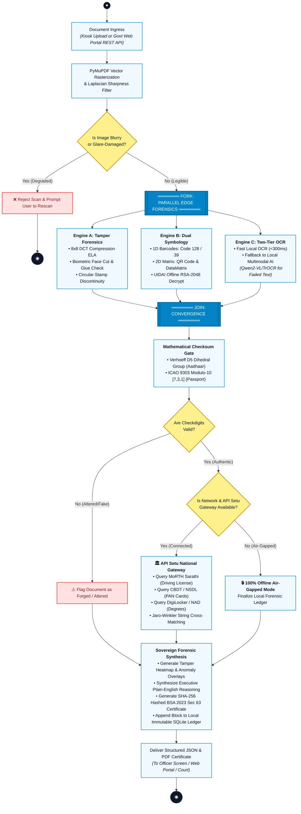

# VERIDOC — StarUML Technical Activity Diagram (Flowchart)
## Official UML Process Flow for Slide 2 & Slide 3 (Smart India Hackathon)

> **Diagram Type**: UML Activity Diagram (Standard Engineering Flowchart with Swimlanes)  
> **Tool Compatibility**: StarUML, PlantUML, Visual Paradigm, Enterprise Architect, Mermaid.js  
> **Source Code**: [`VERIDOC_ACTIVITY_FLOWCHART.puml`](file:///c:/Users/vilas/Desktop/SIH26188/VERIDOC/VERIDOC_ACTIVITY_FLOWCHART.puml)  

---

## 1. Interactive Mermaid Activity Flowchart



---

## 2. ASCII Representation of the StarUML Activity Flowchart

```
(●) START
 │
 ▼
[ Document Ingress: Kiosk Upload OR Govt Portal REST API (/api/verify) ]
 │
 ▼
[ PyMuPDF Vector Page Rasterization & Laplacian Variance Sharpness Check ]
 │
 ├──► < Is Image Blurry or Glare-Damaged? >
 │        ├── (Yes) ──► [ ❌ Reject Scan & Prompt Rescan ] ──► (◉) STOP
 │        └── (No)
 │
 ▼
═══════════════════════ FORK: PARALLEL EDGE FORENSICS ═══════════════════════
 │                             │                             │
 ▼                             ▼                             ▼
[ ENGINE A: TAMPER CV ]       [ ENGINE B: SYMBOLOGY ]       [ ENGINE C: TWO-TIER OCR ]
• 8x8 DCT Compression ELA     • 1D Barcodes (Code 128)      • Tier 1: Local Fast OCR
• Portrait Edge Cut/Glue      • 2D Matrix (QR/DataMatrix)   • Tier 2: Local AI OCR
• Stamp Circle Discontinuity  • UIDAI RSA-2048 Decrypt        (Qwen2-VL / TrOCR)
 │                             │                             │
 └─────────────────────────────┼─────────────────────────────┘
                               │
                               ▼
═══════════════════════ JOIN: CONVERGENCE ═══════════════════════════════════
                               │
                               ▼
[ Deterministic Checksums: Verhoeff D5 (Aadhaar) & ICAO 9303 (Passport) ]
                               │
 ├──► < Are Checkdigits Mathematically Valid? >
 │        ├── (No) ──► [ ⚠️ Flag as Counterfeit / Altered ID ] ──┐
 │        └── (Yes)                                             │
 │                                                              │
 ▼                                                              │
 ├──► < Is Network & API Setu Connected? >                       │
 │        ├── (Yes: Online)                                     │
 │        │     ▼                                               │
 │        │   [ Query api.apisetu.gov.in: MoRTH / CBDT / NAD ]  │
 │        │   [ Jaro-Winkler Matching: Card vs Live Registry ]  │
 │        │     │                                               │
 │        └── (No: Air-Gapped) ─────────────────────────────────┤
 │              ▼                                               │
 │            [ Finalize Local Offline Sovereign Ledger ]       │
 │              │                                               │
 └──────────────┴───────────────────────────────────────────────┘
                               │
                               ▼
[ Sovereign Forensic Synthesis & Executive Anomaly Report ]
[ Generate SHA-256 Hashed Section 63 BSA 2023 Court Certificate ]
[ Append Cryptographic Digest to Local Immutable SQLite Ledger ]
 │
 ▼
[ Deliver Output: Structured JSON Payload & Tamper-Evident Court PDF ]
 │
 ▼
(◉) STOP
```

---

## 3. How to Import and Open this Flowchart in StarUML

1. Open **StarUML**.
2. Click **Tools $\longrightarrow$ PlantUML $\longrightarrow$ Import PlantUML...**
3. Browse and select: [`VERIDOC_ACTIVITY_FLOWCHART.puml`](file:///c:/Users/vilas/Desktop/SIH26188/VERIDOC/VERIDOC_ACTIVITY_FLOWCHART.puml).
4. StarUML will automatically create an **Activity Diagram** with:
   - Initial & Final Nodes (black circle and bullseye).
   - Swimlane partitions (`User Layer`, `VERIDOC Edge Core`, `Government DPI`, `Judicial Ledger`).
   - Fork and Join horizontal bars representing parallel execution.
   - Decision diamonds for quality gates and checksum checks.
   - Beautiful rounded action states with transition arrows.
