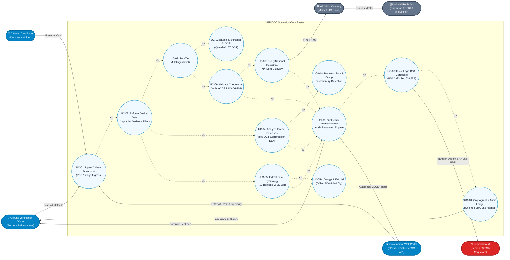

# VERIDOC — StarUML & PlantUML Use Case Specification
## System Use Case Diagram for Smart India Hackathon (Slide 2 & Slide 3)

> **Target System**: VERIDOC Sovereign Document Forensics & Dual-Trust Platform  
> **UML Standard**: UML 2.5 Specification (Use Case Modeling)  
> **Compatible Tools**: StarUML, PlantUML, Mermaid.js, Enterprise Architect, Visual Paradigm  

---

## 1. Visual Mermaid Use Case Diagram



---

## 2. ASCII Text Use Case Diagram (For Quick Terminal/Console View)

```
====================================================================================================
ACTORS                          VERIDOC SOVEREIGN CORE SYSTEM                          ACTORS
====================================================================================================

[👤 Citizen]
     │
     │ Presents Card
     ▼
[👮 Field Officer] ────┐
                       │
[🌐 Govt Web Portal]───┼──► (UC-01: Ingest Citizen Document: PDF / Image)
  (ePass / eDistrict)  │           │
                       │           ▼ <<include>>
                       │    (UC-02: Enforce Optical Quality Gate - Laplacian Filter)
                       │           │
                       │           ├──────────────┬──────────────┬──────────────┐
                       │           ▼ <<include>>  ▼ <<include>>  ▼ <<include>>  ▼ <<include>>
                       │       (UC-03: Two-Tier (UC-04: 8x8 DCT (UC-05: Dual   (UC-06: Verhoeff
                       │             OCR)          ELA Tamper)    Symbology)    & ICAO Math)
                       │           │              │              │              │
                       │           │ <<extend>>   │ <<include>>  │ <<extend>>   │
                       │           ▼              ▼              ▼              │
                       │       (UC-03b: Local  (UC-04a: Face   (UC-05a: UIDAI   │
                       │        AI OCR)         & Stamp Cut)    RSA Decrypt)    │
                       │           │              │              │              │
                       │           └──────────────┴───────┬──────┴──────────────┘
                       │                                  │
                       │                                  ▼ <<extend: if online>>
                       │                           (UC-07: Query API Setu Gateway)
                       │                                  │
                       │                                  ├──► [🏛️ API Setu (MeitY)]
                       │                                  │          │
                       │                                  │          ▼
                       │                                  │    [🗄️ Parivahan / CBDT]
                       │                                  │
                       │                                  ▼ <<include>>
                       │                           (UC-08: Synthesize Forensic Verdict)
                       │                                  │
                       │         ┌────────────────────────┴────────────────────────┐
                       │         ▼ <<include>>                                     ▼
                       │  (UC-09: Issue Court BSA 2023 Cert)                (Return JSON Result)
                       │         │                                                 │
                       │         ▼ <<include>>                                     ▼
                       │  (UC-10: SHA-256 Audit Ledger)                   [🌐 Govt Web Portal]
                       │         │
                       ▼         ▼
             [👮 Field Officer] [⚖️ Judicial Court / Magistrate]
====================================================================================================
```

---

## 3. Formal Use Case Specification Table

| Use Case ID | Use Case Name | Primary Actor | Preconditions | Trigger | Main Success Scenario (Postcondition) |
| :--- | :--- | :--- | :--- | :--- | :--- |
| **UC-01** | Ingest Citizen Document | Verification Officer / Govt Portal | System is initialized (Edge Kiosk or FastAPI service running). | User uploads PDF/Image or Web Portal sends `POST /api/verify`. | Document is accepted, rasterized via PyMuPDF, and passed to Quality Gate. |
| **UC-02** | Enforce Quality Gate | System Internal | Ingress document is converted to pixel matrix. | Execution of UC-01. | Computes Laplacian Variance ($\sigma^2$). Rejects blurry/glare scans; approves legible cards. |
| **UC-03** | Two-Tier Multilingual OCR | System Internal | Image passed quality filter. | Completion of UC-02. | Tier-1 extracts text in <300ms. If confidence < 75% or regional script, extends to **UC-03b (Local AI OCR)**. |
| **UC-04** | Analyze Tamper Forensics | System Internal | Image passed quality filter. | Completion of UC-02. | Performs 8×8 DCT Error Level Analysis. Generates anomaly heatmap highlighting spliced photos or altered digits. |
| **UC-05** | Extract Dual Symbology | System Internal | Image passed quality filter. | Completion of UC-02. | Native zxing classifies 1D Linear Barcodes (Code 128/39) vs 2D Matrix Codes (QR). Decrypts UIDAI RSA signature. |
| **UC-06** | Validate Mathematical Checksums | System Internal | Extracted ID strings from UC-03 or UC-05. | Text extraction completion. | Executes Verhoeff $D_5$ check on 12-digit Aadhaar and ICAO 9303 modulo-10 on Passport MRZ. Flagged if math fails. |
| **UC-07** | Query National Master Registries | API Setu Gateway (MeitY) | Network connection is active; valid document number present. | Checksum verification passes and network is online. | Sends authenticated request to `apisetu.gov.in`. Cross-references Parivahan Sarathi (DL) or CBDT (PAN). |
| **UC-08** | Synthesize Forensic Verdict | System Internal | Forensic signals from UC-03 to UC-07 gathered. | All pipeline engines complete. | Sovereign AI synthesizes ELA score, OCR data, and API matches into an executive plain-English verdict. |
| **UC-09** | Issue Court BSA Certificate | Judicial Court / Legal Authority | Verdict generated in UC-08. | Officer or portal requests formal audit certification. | Stamped PDF certificate generated under **Section 63 Bharatiya Sakshya Adhiniyam, 2023** with SHA-256 hash. |
| **UC-10** | Maintain Cryptographic Ledger | Verification Officer | Verification session complete. | Completion of UC-09. | Session digest appended to sequential blockchain-style SHA-256 audit block in local SQLite database. |

---

## 4. How to Import and Open in StarUML

You can open this diagram directly in **StarUML** using either of these two methods:

### Method A: Import via PlantUML in StarUML (Recommended)
1. In the project folder, locate the generated file: [`VERIDOC_USE_CASE.puml`](file:///c:/Users/vilas/Desktop/SIH26188/VERIDOC/VERIDOC_USE_CASE.puml).
2. Open **StarUML**.
3. Go to **Tools $\longrightarrow$ PlantUML $\longrightarrow$ Import PlantUML...** (or install the free PlantUML extension in StarUML via *Extension Manager*).
4. Select `VERIDOC_USE_CASE.puml`. StarUML will automatically lay out the Actors, Use Cases, System Boundary, `<<include>>`, and `<<extend>>` connectors!

### Method B: Copy PlantUML into StarUML / Online PlantText
* If you don't have the StarUML extension installed, open **[planttext.com](https://www.planttext.com/)** or **[plantuml.com](http://www.plantuml.com/)**, paste the contents of `VERIDOC_USE_CASE.puml`, and export as a high-resolution PNG or SVG to insert directly into your PowerPoint presentation!
